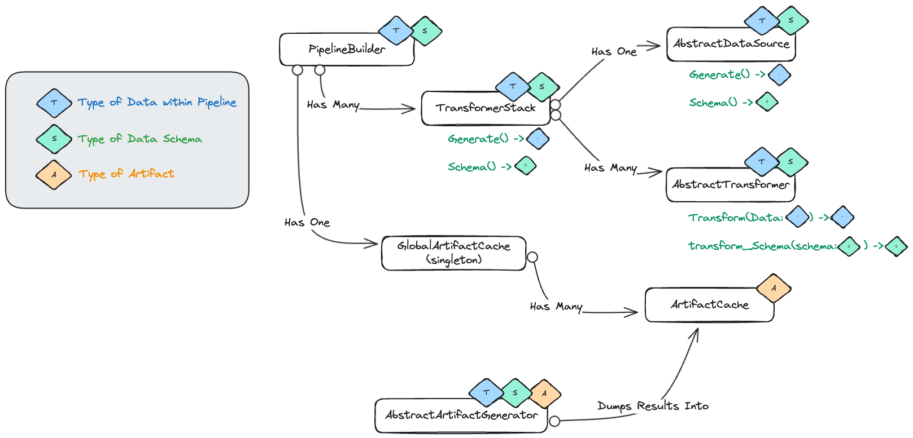
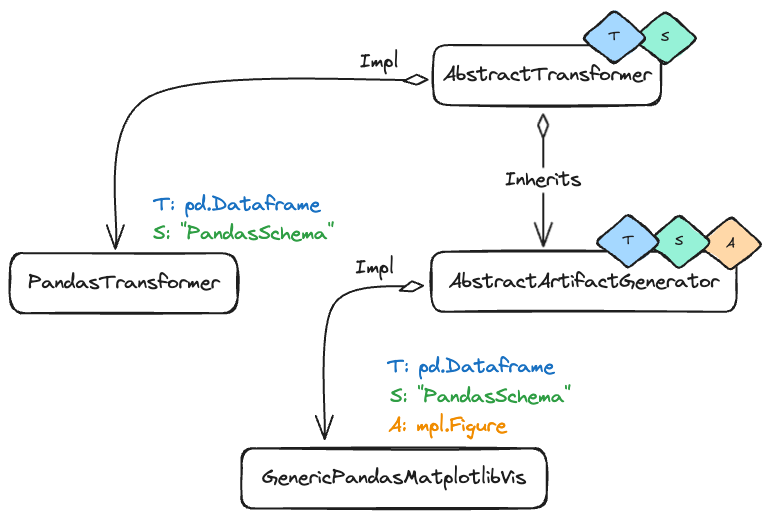
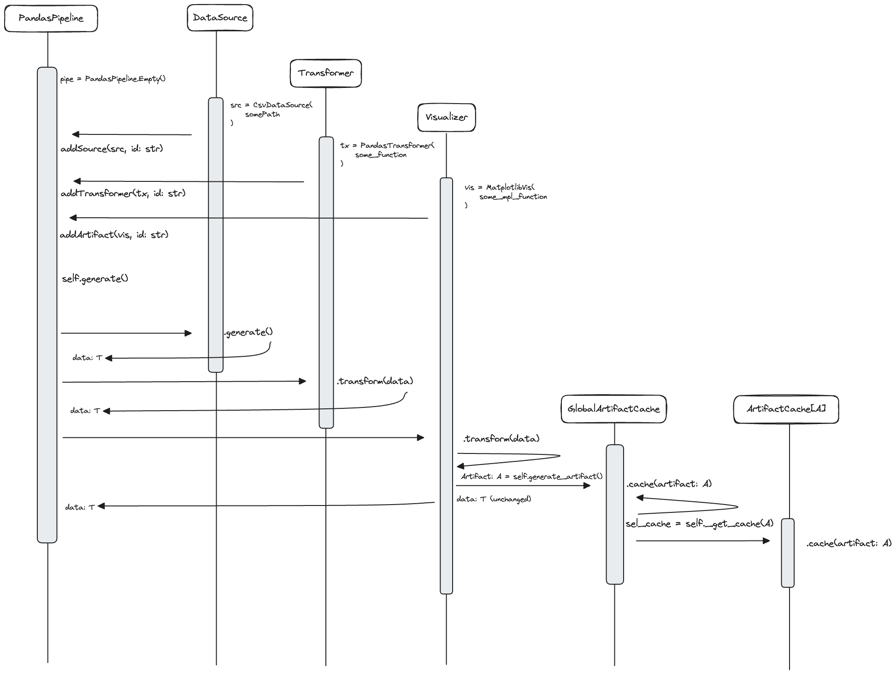

A Home-Brewed ETL pipeline for practicing OOP fundamentals. There are many ETL Solutions out there, but this one is mine :)

in all honesty, this isnt the most functional or efficient tool, I think the restrictiveness of the design is currently holding back its effectiveness (a good tool should be easy to use, and easy to extend). While a fun exercise in Typing, i think tying the classes to their specific types is limiting, and doesnt (currently) easily extend to other data sources or transformers.

for example, if a user were to create a pipeline that uses pandas, it would be great if it could easily be implemnted with Dask/pyspark with the structure (currently it would need to be re-implemented).

things to work on!

## General Class Structure

### Example Pandas Implementation

## Example Interaction Diagram

